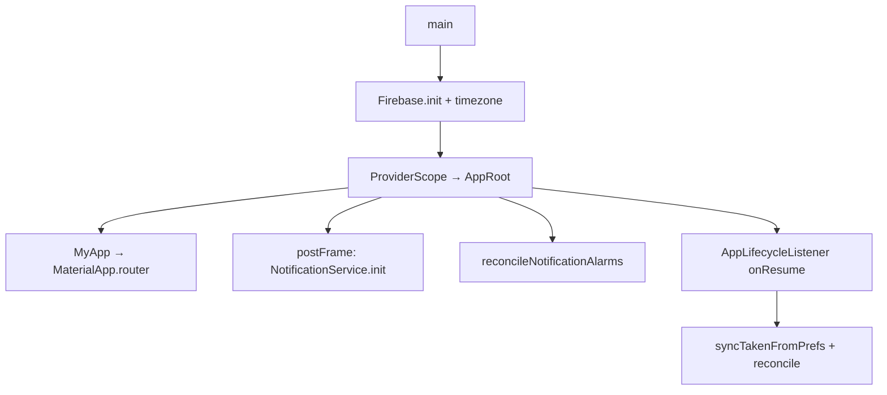
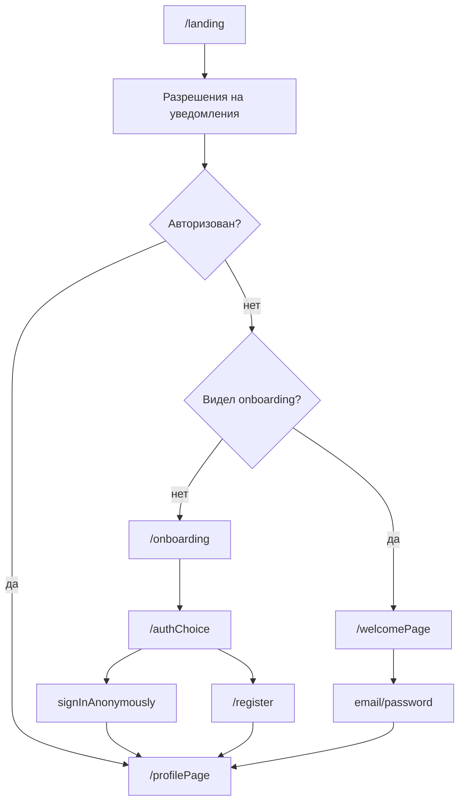

# Карта проекта Pillura Med

Мобильное Flutter-приложение для учёта лекарств, напоминаний о приёме и совместного доступа к спискам (подопечные, шаринг).

---

## Стек

| Слой | Технология |
|------|------------|
| UI | Flutter, Material 3 |
| Состояние | Riverpod 3 (`AsyncNotifier`, `FutureProvider`) |
| Навигация | go_router (`StatefulShellRoute`, redirect по auth) |
| Backend | Firebase Auth + Cloud Firestore |
| Уведомления | flutter_local_notifications + timezone |
| Локальное хранилище | shared_preferences |
| Ошибки репозиториев | dartz `Either` |

---

## Архитектура (Clean Architecture)

```
┌─────────────────────────────────────────────────────────┐
│  presentation/                                          │
│  pages · widgets · providers (Riverpod)               │
└──────────────────────────┬──────────────────────────────┘
                           │ читает интерфейсы
┌──────────────────────────▼──────────────────────────────┐
│  domain/                                                │
│  entities · enums · repositories (abstract)             │
└──────────────────────────┬──────────────────────────────┘
                           │ реализует
┌──────────────────────────▼──────────────────────────────┐
│  data/                                                  │
│  firebase_*_repository · models (route extra)           │
└─────────────────────────────────────────────────────────┘

         core/ — утилиты, тема, уведомления (без бизнес-логики фич)
```

**Направление зависимостей:** `presentation → domain, core` · `data → domain, core` · `domain` не зависит от остальных.

Подробные правила кодстайла: `.cursor/rules/flutter-clean-arch-riverpod3.mdc`.

---

## Структура `lib/`

```
lib/
├── main.dart                      # Точка входа: Firebase, timezone, ProviderScope
├── firebase_options.dart          # Конфиг Firebase (генерируется CLI)
│
├── core/                          # Общие утилиты
│   ├── app_snackbar.dart          # Единый SnackBar
│   ├── listen_errors.dart         # Ошибки провайдера → SnackBar
│   ├── notification_service.dart  # Планирование/отмена локальных уведомлений
│   ├── theme/
│   │   ├── app_theme.dart         # AppTheme.light
│   │   └── profile_link_colors.dart
│   └── extension/
│       ├── theme_extension.dart   # context.theme, context.primaryColor
│       └── time_of_day_extension.dart
│
├── domain/
│   ├── entities/
│   │   ├── auth_user.dart         # UID, email, isAnonymous, isWard
│   │   ├── medication.dart        # Лекарство + расписание
│   │   ├── intake_rec/intake_record.dart  # Запись приёма на конкретное время
│   │   ├── repeat_rule.dart       # Правило повтора (интервал, дни недели…)
│   │   ├── course_duration.dart   # Длительность курса / перерыва
│   │   ├── user_link.dart         # Связь между пользователями
│   │   ├── linked_user_access.dart # Профиль + права доступа
│   │   └── share_invite.dart      # QR/код приглашения
│   ├── enums/
│   │   ├── dosage_type.dart       # таблетки, капли, мл…
│   │   ├── meal_relation.dart     # до/после еды
│   │   ├── repeat_rule_type.dart
│   │   ├── course_duration_unit.dart
│   │   └── weekday.dart
│   └── repositories/
│       ├── auth_repository.dart
│       └── medication_repository.dart
│
├── data/
│   ├── repositories/
│   │   ├── firebase_auth_repository.dart
│   │   └── firebase_medication_repository.dart
│   └── models/                    # Только для передачи через GoRouter extra
│       ├── add_medication_route_data.dart
│       ├── medication_data.dart
│       └── share_medications_route_data.dart
│
├── presentation/
│   ├── pages/
│   │   ├── landing.dart           # Старт: разрешения + роутинг
│   │   ├── auth_gate.dart         # (legacy) виджет-обёртка auth → Profile/Auth
│   │   ├── profile_page.dart      # Главный экран: список лекарств, профили
│   │   ├── medication_page.dart   # Вкладка «Статистика» (заглушка)
│   │   ├── add_medication.dart    # Форма добавления/редактирования
│   │   ├── account_page.dart      # Настройки аккаунта
│   │   ├── welcome_page.dart
│   │   ├── onboarding/
│   │   │   ├── onboarding_page.dart    # Слайды первого запуска
│   │   │   ├── auth_choice_page.dart   # Гость / регистрация (первый вход)
│   │   │   ├── authorization_page.dart # Вход email (повторный)
│   │   │   ├── login_page.dart
│   │   │   └── register_page.dart
│   │   └── add_person/
│   │       ├── menu_add_person.dart
│   │       ├── add_ward.dart           # Создание подопечного
│   │       └── share_medications_page.dart
│   ├── widgets/                   # Переиспользуемые UI-компоненты форм
│   │   ├── medication_card.dart
│   │   ├── dosage_widget.dart
│   │   ├── interval_widget.dart
│   │   ├── course_duration_widget.dart
│   │   └── …
│   └── providers/
│       ├── auth_providers.dart
│       ├── medication_provider.dart
│       ├── repository_provider.dart
│       ├── notification_provider.dart
│       └── onboarding_provider.dart
│
└── router/
    ├── app_router.dart            # GoRouter + redirect
    └── scaffold_with_navbar.dart  # Bottom nav (3 ветки)
```

---

## Запуск приложения



**`AppRoot`** (`main.dart`):
- Инициализирует уведомления после первого кадра.
- При смене `currentUserIdProvider` пересчитывает или отменяет все alarm'ы.
- При `onResume` синхронизирует отметки «принял/пропустил» из `SharedPreferences` (ответы на push в фоне).

---

## Поток навигации и авторизации



**Публичные маршруты** (без auth): `/landing`, `/onboarding`, `/authChoice`, `/login`, `/register`, `/welcomePage`.

**Redirect в `app_router.dart`:** авторизованный пользователь с публичного маршрута → `/profilePage`; неавторизованный на защищённом → `/landing`.

| Путь | Экран | Назначение |
|------|-------|------------|
| `/landing` | `Landing` | Старт, разрешения, развилка |
| `/onboarding` | `OnboardingPage` | Слайды при первом запуске |
| `/authChoice` | `AuthChoicePage` | Гость или регистрация |
| `/welcomePage` | `AuthorizationPage` | Вход по email (повторный) |
| `/login` | `LoginPage` | Вход |
| `/register` | `RegisterPage` | Регистрация |
| `/medicationPage` | `MedicationPage` | Вкладка 0 (заглушка статистики) |
| `/profilePage` | `ProfilePage` | Вкладка 1 — основной список лекарств |
| `/account` | `AccountPage` | Аккаунт (вложен в ветку профиля) |
| `/addMedication` | `AddMedicationPage` | Добавить/редактировать лекарство |
| `/shareMedications` | `ShareMedicationsPage` | QR-шаринг списка |
| `/add` | `MenuAddPerson` | Вкладка 2 — меню добавления |
| `/add/ward` | `AddWard` | Создать подопечного |

Данные в `state.extra` — только через модели из `data/models/`.

### Нижняя навигация (`ScaffoldWithNavBar`)

| Индекс | Ветка GoRouter | Маршрут по умолчанию | Подпись в UI |
|--------|----------------|----------------------|--------------|
| 0 | branch 0 | `/medicationPage` | «Статистика» |
| 1 | branch 1 | `/profilePage` | «Лекарства» |
| 2 | branch 2 | `/add` | «Добавить» |

---

## Основные фичи

### 1. Лекарства и приёмы

- **`Medication`** — название, дозировка, связь с едой, правило повтора, времена приёма, длительность курса.
- **`IntakeRecord`** — конкретный запланированный приём (дата/время, `isTaken`: null / true / false).
- **`MedicationNotifier(userId)`** — CRUD, сортировка по ближайшему приёму, синхронизация с prefs.
- **`ProfilePage`** — переключение между своим профилем и связанными (подопечные / shared), фильтр «сегодня / все».

### 2. Авторизация

| Режим | Описание |
|-------|----------|
| Гость (`isAnonymous`) | Ограниченный функционал, можно апгрейд до email |
| Email | Регистрация / вход / выход |
| Подопечный (`isWard`) | Отдельный аккаунт, созданный опекуном |

`AuthNotifier` слушает `authStateChanges()`, маппит Firebase → `AuthUser`, показывает transient-ошибки через `_setTransientError`.

### 3. Связи пользователей (`UserLink`)

| Тип | Назначение |
|-----|------------|
| `ward` | Опекун управляет профилем подопечного |
| `share` | Доступ к чужому списку лекарств (viewer / editor) |

`linkedUsersProvider` → список `LinkedUserAccess` для текущего UID.

### 4. Уведомления

- Планируются в `NotificationService` на основе `IntakeRecord`.
- ID уведомлений — счётчик в Firestore (`notifIds/notification_id_counter`).
- Действия «Принял» / «Пропустил» в push сохраняются в `SharedPreferences`, подхватываются при `onResume`.

---

## Firestore (коллекции)

| Коллекция | Содержимое |
|-----------|------------|
| `users` | Профиль пользователя (имя, isWard, …) |
| `medications` | Лекарства (`userId`, расписание, `notificationIds`) |
| `intake_records` | Записи приёмов по лекарству |
| `user_links` | Связи outUserId ↔ inUserId (permission, type, status) |
| `share_invites_by_profile` | Активные приглашения |
| `share_invites_lookup` | Поиск invite по коду |
| `notifIds` | Счётчик ID локальных уведомлений |

---

## Провайдеры (Riverpod)

| Провайдер | Файл | Назначение |
|-----------|------|------------|
| `goRouterProvider` | `router/app_router.dart` | Навигация |
| `authNotifierProvider` | `auth_providers.dart` | Auth-состояние, signIn/signOut/register |
| `linkedUsersProvider` | `auth_providers.dart` | Связанные профили |
| `currentUserIdProvider` | `repository_provider.dart` | UID из Firebase Auth stream |
| `authFRepositoryProvider` | `repository_provider.dart` | `FirebaseAuthRepository` |
| `medicationRepositoryByUserIdProvider` | `repository_provider.dart` | Репозиторий лекарств по userId |
| `medicationNotifierProvider(userId)` | `medication_provider.dart` | Список `MedicationWithIntakes` |
| `notificationServiceProvider` | `notification_provider.dart` | Обёртка над NotificationService |
| `hasSeenOnboardingProvider` | `onboarding_provider.dart` | Флаг первого запуска (SharedPreferences) |

Состояние фич — `AsyncNotifier` + `AsyncValue` (`loading` / `data` / `error`).

---

## Общие методы `core/` — использовать вместо дублирования

### AppSnackBar (`core/app_snackbar.dart`)

```dart
AppSnackBar.show(context, 'Текст');
```

Не вызывать `ScaffoldMessenger.showSnackBar` напрямую. Повторные вызовы, пока SnackBar виден, игнорируются.

### listenErrors (`core/listen_errors.dart`)

```dart
listenErrors(context, ref, someNotifierProvider);
```

Подписка на `hasError` провайдера → показ через `AppSnackBar`.

### Тема

```dart
theme: AppTheme.light,           // в main.dart
context.theme / context.primaryColor  // в виджетах (#202D85)
```

### NotificationService

Инициализация в `AppRoot`. Планирование alarm'ов — только через сервис, не из UI напрямую.

---

## Виджеты форм (`presentation/widgets/`)

| Виджет | Назначение |
|--------|------------|
| `dosage_widget` | Дозировка + единица |
| `meal_relation_widget` | До/после/во время еды |
| `interval_widget` / `automatic_interval_widget` | Интервал повтора |
| `manual_intake_widget` | Ручные времена приёма |
| `course_duration_widget` | Длительность курса и перерыва |
| `medication_card` | Карточка в списке |
| `input_block` | Стилизованное поле ввода |

---

## Ограничения гостевого режима

Перед действиями проверять в UI: `isAnonymous`, `isWard`, `hasShareStatus`, `canEdit`.

Сообщения об ограничениях — только `AppSnackBar.show`. Примеры: `menu_add_person.dart`, `add_medication.dart`, `profile_page.dart` (`_shareUnavailableReason`).

---

## Чеклист при добавлении кода

| Задача | Куда / что |
|--------|------------|
| Новый экран | `presentation/pages/` + маршрут в `app_router.dart` |
| Состояние фичи | `AsyncNotifier` в `presentation/providers/` |
| Доступ к данным | интерфейс `domain/repositories/`, реализация `data/repositories/` |
| Данные для навигации | модель в `data/models/`, `state.extra` |
| Переиспользуемый UI | `presentation/widgets/` |
| Сообщение пользователю | `AppSnackBar.show` |
| Ошибка провайдера | `listenErrors` |
| Стили | `AppTheme` + extensions |

---

## Корень репозитория (вне `lib/`)

| Путь | Назначение |
|------|------------|
| `android/`, `ios/`, `web/`, … | Платформенные оболочки |
| `assets/icons/` | SVG-иконки (google.svg) |
| `pubspec.yaml` | Зависимости |
| `.firebaserc` | Проект Firebase |
| `docs/PROJECT_MAP.md` | Этот файл |
